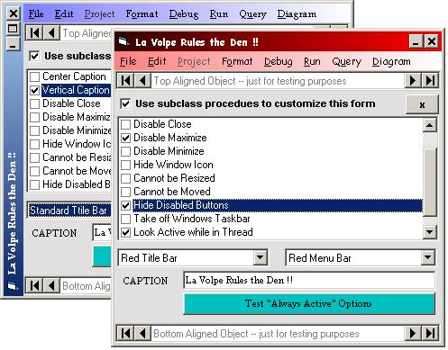



## LaVolpe Custom Windows: Part I

### Description

Part 1. Prequel to a full-blown skinning application. This part does not skin but attempts to completely control the window non-client area. Provided in hopes you will help identify any bugs on different O/Ss. Works well on 98/2K. The other parts of this project will be submitted after bugs fixed in this part and feedback has been addressed. Part 2 will be skinned version compatible with MDIs, Part 3 will include routines for custom-drawn menus. Heavily subclassed and heavily commented; but still a work in progress. Feedback is definitely requested especially pertaining to bugs and suggestions.
 
### More Info
 

             |
---                |---
**Submitted On**   |2004-11-23 23:09:34
**By**             |[LaVolpe](https://github.com/Planet-Source-Code/PSCIndex/blob/master/ByAuthor/lavolpe.md)
**Level**          |Advanced
**User Rating**    |5.0 (224 globes from 45 users)
**Compatibility**  |VB 6\.0
**Category**       |[Custom Controls/ Forms/  Menus](https://github.com/Planet-Source-Code/PSCIndex/blob/master/ByCategory/custom-controls-forms-menus__1-4.md)
**World**          |[Visual Basic](https://github.com/Planet-Source-Code/PSCIndex/blob/master/ByWorld/visual-basic.md)
**Archive File**   |[LaVolpe\_Cu18215811242004\.zip](https://github.com/Planet-Source-Code/lavolpe-lavolpe-custom-windows-part-i__1-57406/archive/master.zip)

